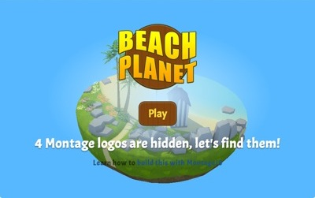

Beach Planet
============



[Live Demo](http://montagejs.github.io/beachplanetblog/) (open in a WebGL-enabled browser)

## About the Demo

Beach Planet is a simple hidden-object game that demonstrates the principles described in this tutorial. The objective of the game is to find four MontageJS logos by selecting different locations and clicking objects to reveal the hidden logos. The demo uses viewpoints, animated 3D transformations, and event handlers.

To help simplify building interactive 3D experiences in the browser, provides the SceneView component. SceneView is a WebGL-based 3D component that makes manipulating the individual elements of a 3D scene just as easy as manipulating conventional HTML elements in the DOM.

The demo application showcases the use of the [MontageJS 3D SceneView component](https://github.com/fabrobinet/mjs-volume). The component is designed to help front-end web developers and designers build interactive 3D experiences in the browser using their existing HTML, CSS, and JavaScript skills. Using the component, you can integrate a 3D scene in a MontageJS web application, manipulate individual elements of a 3D scene using CSS, and animate elements of a 3D scene using the same method that you would use to perform CSS transitions.

To learn more about the Beach Planet demo and the SceneView component, refer to the [Building 3D Applications with MontageJS](http://montagejs.org/docs/tutorial-3d-applications-with-montagejs.html) tutorial on the MontageJS website. 

## Installation

To run this demo locally you need:

* A web server of your choice. MontageJS applications are client-side applications with no particular back-end dependency.
* Node.js and npm. MontageJS uses Node.js and npm for its developer tools and for code dependency management.
* Cloned GitHub repo of this demo.

First, if you haven't done so already, [download](http://nodejs.org/download/) and run the prebuilt Node.js installer for your platform from the Node.js website to install npm.

Then, to run the Beach Planet demo locally, follow these steps:

1. Clone the beachplanetblog [GitHub repo](https://github.com/montagejs/beachplanetblog) in your desktop. 

2. Use a command line tool to navigate to the cloned directory and install the modules required to run the demo:
        
    ```
    cd beachplanetblog
    npm install
    ```
  
    This installs the node_modules directory in the beachplanetblog root directory which includes all the dependencies you need to run the application locally. 
    
3. Launch your preferred HTTP server and point your browser to the associated port.

    > During development MontageJS applications rely on XHR to load their various components and modules, which is why you will need a web server to serve the demo.

    > If you happen to have the latest version of [minit](https://github.com/montagejs/minit), the MontageJS Initializer, installed (`sudo npm install -gq minit@latest`) you can run `minit serve &` from within the demo directory to set up a server on demand.

## Application Structure

Folder / File | Description
------------ | ------------- 
assets | Contains the 3D scene and sound asset files used in the demo, as well as the image linked to from this readme.
ui | Contains the user interface components of the demo application: beachplanet.reel contains the complete 3D application; main.reel contains the fallback (for for non-WebGL browsers). 
index.html | Is the entry-point HTML document.
LICENSE.md | Contains copyright information.
package.json | Describes the application and its dependencies.
README.md | Provides information about the demo application and how to install it.

## Contact Us

Got questions? Join us on [irc.freenode.net#montage](http://webchat.freenode.net/?channels=montage).

Got feedback or want to report a bug? Let us know by creating a new [GitHub issue](https://github.com/montagejs/beachplanetblog).

## Credit

This demo application was created by the MontageJS team.

The soundtrack is available on [opengameart](http://opengameart.org):

* Music: [White Sands Day Night](http://opengameart.org/content/white-sands-day-night) by MegaJackie.
* Sound: [getruby](http://opengameart.org/content/get-ruby-se).
